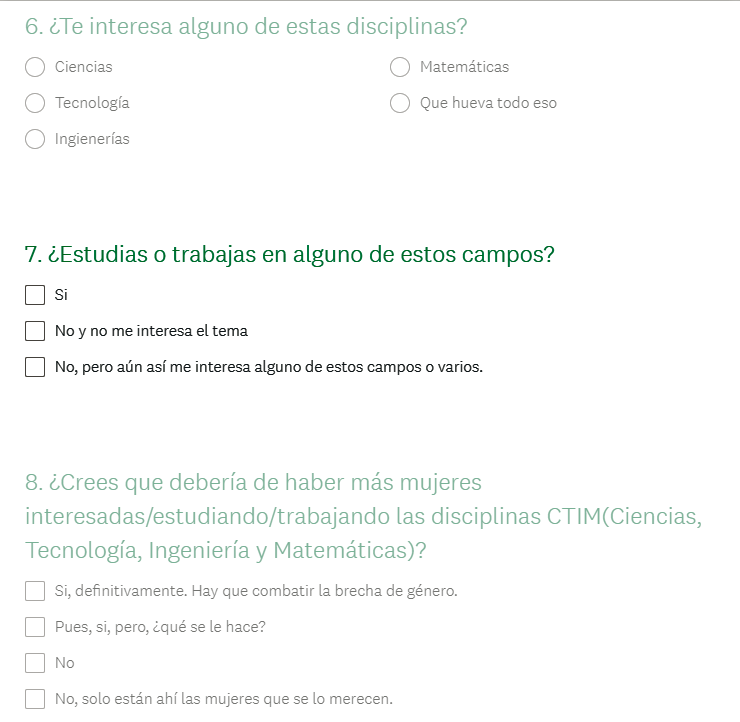
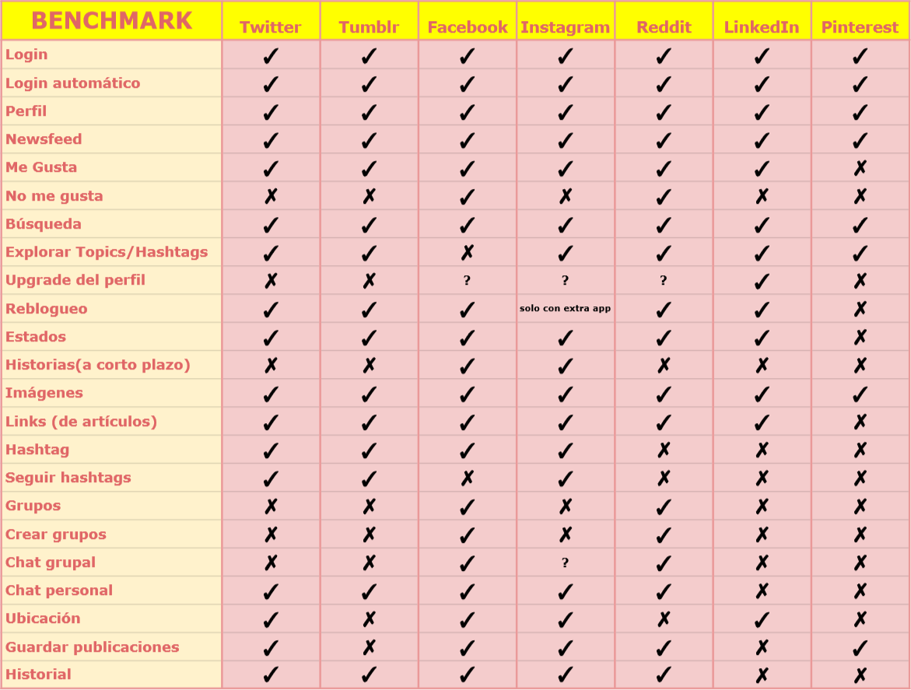
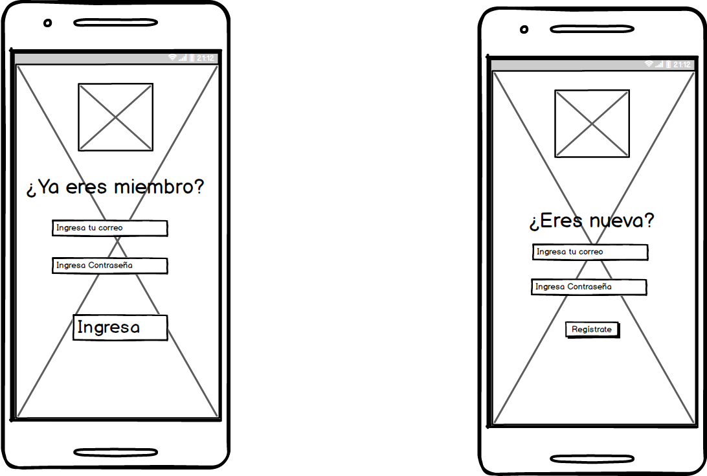
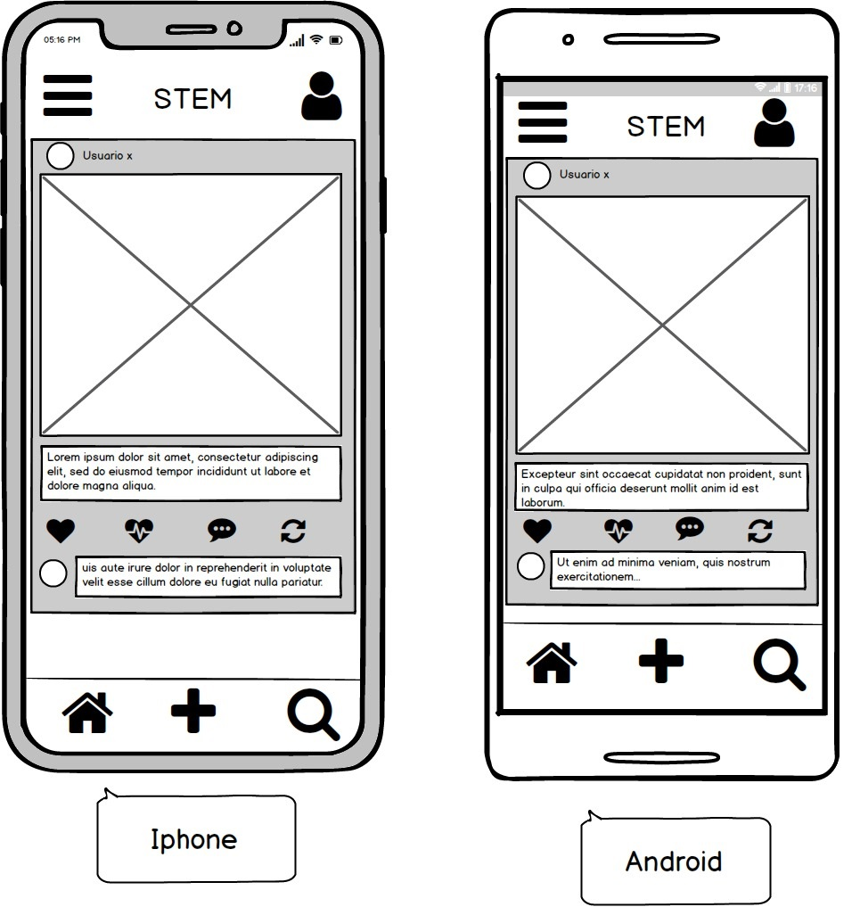

# Cluster2.0
--------------------------------------------------------------------
> A Vue.js project

Cluster2.0 is a social network built by and for women interested in Science, Tecnology, Engineering and Mathematics.

## Introduction

Actualmente en el mundo del STEM las mujeres siguen siendo una minoría, por ejemplo, constituyen sólo un 30% de los investigadores en el mundo. Sin ir más lejos, las mujeres en México ocupan el 1% en las carreras de ingenierías en cómputo.

Para ayudar a acortar esta gran brecha, es necesario hacer una comunidad para estas. Así encontrarán de una manera rápida y al alcance de su celular apoyo entre ellas, discusiones constructivas e influenciar positivamente a las jóvenes que estén pensando desarrollarse en este mundo, pero que por ciertas circunstancias aún no toman ese camino.

## Justification

En la actualidad las redes sociales se han convertido en una herramienta en la vida diaria de los mexicanos. Según el estudio Sobre los Hábitos de los Usuarios de Internet en México, realizado por la Asociación de Internet, el 95% de los mexicanos con acceso a internet cuentan con un perfil de Facebook; en cuestión de número de usuarios este estudio nos arroja que las mujeres ocupan el primer lugar siendo el 51%.

Las redes sociales también sirven como herramienta para la difusión de las ciencia, la cultura y la tecnología y también para hacer comunidad con personas de todo el mundo.

## Mission

Cluster was created to unite women interested in STEM from all around the world *in one social network*, where they can join forces, create alliances, share job opportunities, gain new knowledge and find out on what researches other women are working at.

Investors can participate in Cluster's community through ads, which will be placed organically in the user's newsfeed.

## Survey Research

The survey included 100 mexican woman, who were recluted in different Social Networks, like Twitter, Facebook and Whatsapp. The sample group were asked the following questions about social networks and their interest in STEM disciplines.

### Questions



1. How old are you?
2. What kind of social networks do you use and what is your favorite? (Multiple answers)
3. How often do you use a Social Network?
4. What do you love most about your preferred Social Network?
5. You prefer some social networks but there are parts of the design that you HATE, which ones?
6. Are you interested in any of these disciplines?
7. Do you study or work in any of these fields?
8. Do you think there should be more women interested / studying / working in STEM disciplines (Science, Technology, Engineering and Mathematics)?
9. How interested would you be in a social network dedicated to these disciplines?
10. How often would you use a Social Network dedicated to women in the STEM area?

### Results

## Benchmark

In order to design a social network that fully satisfies the users, similar apps were analyzed and compared based on their flow and functionalities.


## Research on users preffered general features in apps (usability and funcionality)

## Mockups




## Build Setup

``` bash
# install dependencies
npm install

# serve with hot reload at localhost:8080
npm run dev

# build for production with minification
npm run build

# build for production and view the bundle analyzer report
npm run build --report

# run unit tests
npm run unit

# run e2e tests
npm run e2e

# run all tests
npm test
```

For a detailed explanation on how things work, check out the [guide](http://vuejs-templates.github.io/webpack/) and [docs for vue-loader](http://vuejs.github.io/vue-loader).

## Tech/framework used

Built with:

* Javascript
* HTML5
* CSS3
* Node.js
* Vue.js
* Visual Code Studio

## Table of Contents

```text
./
├── .babelrc
├── .editorconfig
├── .eslintignore
├── .eslintrc.js
├── .firebaserc
├── .gitignore
├── .postcssrc.js
├── firebase.json
├── firebase.indexes.json
├── firestore.rules
├── index.html
├── package-lock.json
├── package.json
├── README.md
├── storage.rules
├── .firebase
│   └── *
├── build
│   └── *
├── config
│   └── *
├── dist
│   ├── static
│   │   └── * 
│   └── index.html
├── node_modules
│   └── *
├── src
│   ├── assets
│   │   └── logo.jpg
│   ├── components
│   │   ├── Login.vue
│   │   ├── 
│   │   └── 
│   ├── router
│   │   └── index.js
│   ├── App.vue
│   └── main.js
├── static
│   └── .gitkeep
└── test
    ├── e2e
    │   └── *
    └── unit
        └── *

```

## Tests

--------------------------------------------------------------------

## Build status

--------------------------------------------------------------------

Under construction.

## Contribute

--------------------------------------------------------------------

Please send a pull request if you would like to contribute.
